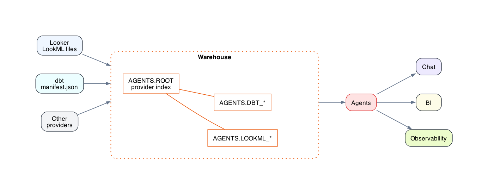

# Agents Schema

Agents need context to answer questions about warehouse data. Agents Schema puts
that context in the warehouse itself, in a standard `AGENTS` schema, so agents
can query metadata next to the data they are reasoning over. See
[Why Agents Schema](#why-agents-schema) for more on the idea behind it and
[SPEC.md](./SPEC.md) for the schema contract.

This repository provides GitHub workflows that ingest source metadata from
your repository and publish it into `AGENTS`.



Run one of the workflows below to populate the `AGENTS` schema from a source
you already have. Once it's populated, anything that already queries your
warehouse can read those tables as ordinary SQL, including Cursor, Claude
Code, notebooks, and internal agents. The fastest path is usually dbt: if your
repo already produces `target/manifest.json`, the workflow only needs the dbt
project path and your warehouse credentials.

After the first run, your warehouse has queryable metadata tables such as
`AGENTS.DBT_MODEL`, `AGENTS.LOOKML_VIEW`, `AGENTS.OSI_DATASET`, or
`AGENTS.POWERBI_MEASURE`. Agents can
use those tables to understand which models and semantic objects exist, how
they are documented, how they relate to the warehouse, and what context is
available before writing or explaining queries.

## Contents

- [Getting Started](#getting-started)
  - [Prerequisites](#prerequisites)
- [Guides](#guides)
  - [Supported Sources](#supported-sources)
  - [Sync Multiple Sources](#sync-multiple-sources)
- [Query with an agent](#query-with-an-agent)
- [Why Agents Schema](#why-agents-schema)
  - [How it works](#how-it-works)
- [Reference](#reference)
  - [CLI](#cli)
  - [Versioning](#versioning)
  - [Specification](#specification)

## Getting Started

There are four supported metadata sources with setup guides and reusable workflows. Pick one to get started quickly.

### Prerequisites

Each workflow writes to your warehouse using a single GitHub Actions secret:
`WAREHOUSE_CREDENTIALS`. The source-specific setup guides show the expected
secret shape and the workflow YAML to copy.

For production warehouse publication, use Snowflake credentials. For local
validation, you can write the same `AGENTS.*` tables to a DuckDB file:

```bash
export WAREHOUSE_CREDENTIALS='{"type":"duckdb","path":"tmp/agents-schema.duckdb"}'
uv run agents-schema powerbi --metadata-path tmp/powerbi-scan-result.json
```

## Guides

### Supported Sources

Each supported source has a setup guide, reusable GitHub workflow, composite
action, example workflow, CLI command, and `AGENTS.ROOT` provider entries.

| Source | Setup guide | Example workflow | Use when you have |
|---|---|---|---|
| dbt | [dbt-setup.md](dbt-setup.md) | [dbt.yml](examples/workflows/dbt.yml) | dbt project or an existing `target/manifest.json` |
| Looker | [looker-setup.md](looker-setup.md) | [looker.yml](examples/workflows/looker.yml) | LookML files |
| OSI | [osi-setup.md](osi-setup.md) | [osi.yml](examples/workflows/osi.yml) | Open Semantic Interchange `*.osi.yaml` files |
| Power BI | [powerbi-setup.md](powerbi-setup.md) | [powerbi.yml](examples/workflows/powerbi.yml) | Fabric / Power BI scanner metadata exports |

### Sync Multiple Sources

Use the reusable workflows together when one repository contains multiple
metadata sources. See [examples/workflows/dbt-looker.yml](examples/workflows/dbt-looker.yml)
and [examples/workflows/dbt-looker-osi.yml](examples/workflows/dbt-looker-osi.yml).
You can combine any of the supported source workflows in the same way when your
repository contains multiple metadata exports.

## Query with an agent

Once `AGENTS` is populated, the
[`agents-schema-analyst`](examples/skills/agents-schema-analyst/SKILL.md) skill lets an AI agent
answer questions about your warehouse — grounded in your real metric definitions from `AGENTS.*`,
not guesses. You need a `snow` CLI connection (run `snow connection add` if you don't have one).

**Claude Code**

```bash
curl -fsSL --create-dirs \
  -o ~/.claude/skills/agents-schema-analyst/SKILL.md \
  https://raw.githubusercontent.com/fivetran/agents_schema/v0.0.6/examples/skills/agents-schema-analyst/SKILL.md
```

Then ask: `/agents-schema-analyst "What is our total MRR this month?"`

**Codex**

```bash
curl -fsSL --create-dirs \
  -o ~/.codex/skills/agents-schema-analyst/SKILL.md \
  https://raw.githubusercontent.com/fivetran/agents_schema/v0.0.6/examples/skills/agents-schema-analyst/SKILL.md
```

Then ask: `$agents-schema-analyst "What is our total MRR this month?"`

## Why Agents Schema

Agents operating over a warehouse need context that is not captured in table
schemas alone: what a table is for, who maintains it, what transformations
produced it, what it costs to query, and how it relates to other tables. Today
this information often lives in wikis, Slack threads, dashboards, and tribal
knowledge. Agents Schema puts it in the warehouse itself, where agents can find
it without leaving the query interface.

Agents Schema is a discovery layer for agents that already query your
warehouse. It gives them a standard place to ask: what curated tables exist,
which system published the metadata, what dbt model or LookML object backs a
dataset, what OSI semantic model describes it, whether a source is stale, and
who owns a data product.

The schema is self-documenting. `AGENTS.ROOT` tells consumers which providers
are present and explains what provider-contributed tables mean. Consumers can
start there for generic discovery, or query well-known extension tables directly
when they already know the shape they need.

Agents Schema is not a replacement for specialized systems, source-native
metadata APIs, or development-time tooling. A dbt MCP server helping an agent
edit a dbt repository should still use dbt source files and artifacts directly.
Agents Schema is the shared, queryable metadata surface for consumers that start
from the warehouse and need context about data that already exists there.

It is closest in spirit to `information_schema`, but extensible across many
providers. Compared with MCP servers, Agents Schema is narrower: it publishes
context inside the warehouse, while MCP servers can expose tools, actions, and
source-specific workflows.

### How it works

1. A workflow in your repository invokes one of this repo's workflows.
2. The workflow checks out your repository and reads source metadata such as
   dbt artifacts, LookML files, OSI YAML files, or JSON/YAML metadata exports.
3. The workflow runs the `agents-schema` CLI at the pinned release tag.
4. The CLI writes normalized metadata into the warehouse under the `AGENTS`
   schema.
5. Agents and downstream tools query `AGENTS` for context close to the data
   itself.

## Reference

### CLI

The GitHub Actions call the CLI with explicit source arguments:

```bash
agents-schema dbt --project-dir dbt_project
agents-schema looker --lookml-dir lookml
agents-schema osi --osi-dir osi
agents-schema powerbi --metadata-path powerbi-scan.json
```

The CLI reads warehouse credentials from `WAREHOUSE_CREDENTIALS`. Supported
destination types are `snowflake` for warehouse publication and `duckdb` for
local validation.

### Versioning

Release tags version the whole repository: reusable workflows, actions, CLI
source, examples, README, and spec.

Pin exact tags in your workflows:

```yaml
uses: fivetran/agents_schema/.github/workflows/agents-schema-dbt.yml@v0.0.6
```

To upgrade, change only the tag in the `uses:` line. The current release tag is
`v0.0.6`.

### Specification

The full schema contract is in [SPEC.md](./SPEC.md). Keep schema definitions and
compatibility rules there; keep this README focused on installation and
source-specific GitHub workflow usage.
