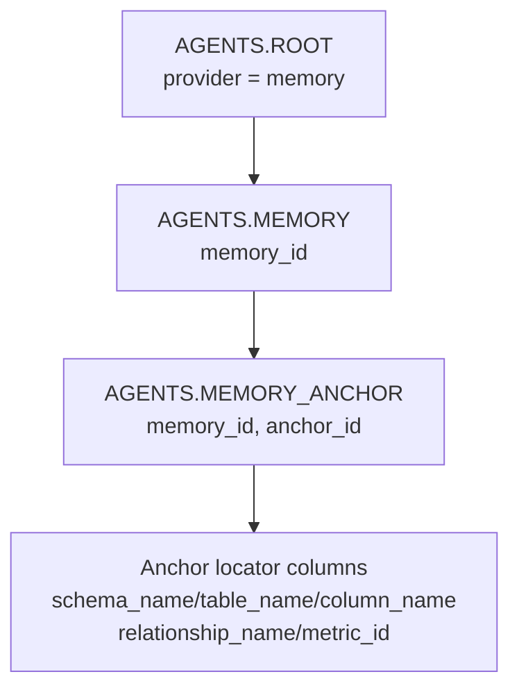

# Memory Provider Proposal

**Status:** Proposal
**Branch:** `notes_provider`

## Summary

Add a general `memory` provider to Agents Schema for durable, agent-facing data memories: query rules, join caveats, unit conversions, status meanings, grain warnings, and project-specific semantic guidance.

The provider is intentionally tool-agnostic. An internal platform job, semantic modeling tool, catalog process, agent workflow, or human-curated repository could all publish memories through the same provider contract.

## When To Use Memory

Memory is the **lightweight path** to anchored, agent-retrievable notes for deployments **without a semantic layer**. It attaches notes directly to physical warehouse objects (schema/table/column) plus logical metrics and relationships, so an agent can pull "the notes relevant to this column" with a simple join — without standing up and maintaining a full semantic model.

If you already run an OSI semantic model, you usually do **not** need memory. OSI carries object-local `ai_context` on every dataset, field, and metric, and that is the natural home for the same notes — "this field is in cents" belongs on the OSI field. Memory overlaps that and is largely redundant for OSI-native teams. The honest scope: reach for memory when there is no semantic layer, or for notes about raw warehouse objects that a semantic model does not cover.

Anchors target physical objects deliberately. A column anchor is reachable both from raw schema and — because OSI fields map down to columns — from an OSI-aware consumer; the reverse is not true. The only logical anchors are `metric` and `relationship`, for things that have no single physical column to point at.

## Motivation

`AGENTS.ROOT` can already hold free-form context and query recipes, and several source providers expose object-local `ai_context`. Those are useful, but they do not give agents a structured way to retrieve "the memories relevant to this table, column, relationship, or metric."

`ROOT` is a discovery surface: it tells an agent which providers and tables exist, and it can carry broad prose. It is not shaped for object-level retrieval. A row like `(internal, revenue_guidance)` might explain cents-to-dollars conversions, but an agent looking at `stripe.invoice.amount_due` has no deterministic join from that column to the `ROOT` row. The agent would have to read broad prose and infer relevance.

Object-local `ai_context` solves a different problem. It works when the context belongs to the same source object that published it, such as a LookML measure or OSI field. It does not work as well for memories that cross providers, attach to a warehouse column that came from dbt but was learned by a catalog tool, describe a relationship between two objects, or need to be updated by an agent after a SQL debugging session. Those memories need their own records plus typed anchors.

Examples agents need at SQL-authoring time:

- Stripe amount columns are stored in cents; divide by 100 for dollar measures.
- Tickets join to assignees through `ticket.assignee_id = user.id`.
- Ticket events fan out ticket rows unless collapsed first.
- Use `closed_at`, not `created_at`, for won revenue recognition.
- `solved` and `closed` both count as resolved tickets.
- Current headcount comes from the latest worker history row per worker.

These are durable data semantics. They are not dashboard inventory, open questions, or scratchpad state.

## Memory As Aggregator

The memory provider is useful even when richer raw providers exist.

A Looker, dbt, OSI, catalog, BI, or query-history provider may expose a large amount of source-specific detail. That detail is valuable for deep inspection, but it can be too broad or noisy to send to agents on every request. A curation process can scan those provider tables, user-approved agent discoveries, SQL reviews, failed-query fixes, and dashboard migrations, then write compact durable memories.

In that pattern, memory becomes a summarizer and routing layer:

- Raw providers keep the complete source data.
- Memory records keep the distilled facts agents should usually remember.
- Memory anchors attach those facts to the tables, columns, metrics, and relationships where they are relevant.
- The optional `source` field points back to the provider object, file, URL, or import job when the agent needs to drill into the raw material.

For example, a Looker provider might expose explores, views, dimensions, measures, dashboard elements, and LookML comments. Instead of always exposing that full provider surface, an offline job or interactive agent could extract durable rules such as "net revenue excludes refunded orders" or "this explore joins order_items at item grain and fans out orders." Those distilled rules can be written as memories anchored to the relevant tables, columns, measures, and relationships. Agents can use the small memory set by default and consult the Looker provider only when they need deeper provenance.

This makes memory a bridge between high-fidelity source providers and compact agent context. It is not a replacement for raw provider tables; it is the layer that captures the parts worth carrying forward.

## Provider Registration

`AGENTS.ROOT` rows:

```text
provider  key            content
memory    overview       Durable semantic memories for agents: query rules, join caveats, units, status meanings, and project-specific data guidance.
memory    memory         One row per durable semantic memory. See AGENTS.MEMORY.
memory    memory_anchor  One row per retrieval anchor for a memory. See AGENTS.MEMORY_ANCHOR.
```

The `memory` provider owns the table contract. The memory tables do not repeat a row-level `provider` column: unlike `AGENTS.ROOT`, the provider is already implied by the table family. If a deployment aggregates memories from many tools, it should preserve that detail in `source` and keep `memory_id` globally stable within `AGENTS.MEMORY`.

## Example Project Memory File

The implemented CLI accepts the canonical list form:

```yaml
memories:
  - memory_id: stripe_amounts_are_cents
    memory_kind: unit_rule
    title: Stripe amounts
    content: Stripe amount columns are stored in cents; divide by 100 for dollar measures.
    source: memories.yaml
    confidence: 0.9
    anchors:
      - anchor_id: invoice_amount_due
        anchor_type: column
        schema_name: stripe
        table_name: invoice
        column_name: amount_due
```

Tools may keep their own project memory file and import it into this canonical shape. For example, a Dataface project could keep a compact `memories.yaml` that is optimized for authors:

```yaml
memories:
  stripe_amounts_are_cents:
    kind: unit_rule
    content: Stripe amount columns are stored in cents; divide by 100 for dollar measures.
    applies_to:
      columns:
        - stripe.invoice.amount_due
        - stripe.charge.amount
      metrics:
        - revenue
```

That file is not a second Agents Schema standard. It is an authoring shape a tool can map into the canonical rows: the memory key becomes `memory_id`, `kind` becomes `memory_kind`, `content` maps directly, and each `applies_to` entry becomes a row in `AGENTS.MEMORY_ANCHOR`.

## Tables

Use singular names to match the existing style: `DBT_MODEL`, `OSI_FIELD`, `LOOKML_VIEW`.

```sql
CREATE OR REPLACE TABLE AGENTS.MEMORY (
  memory_id VARCHAR NOT NULL,
  memory_kind VARCHAR NOT NULL,
  title VARCHAR,
  content TEXT NOT NULL,
  source VARCHAR,
  confidence FLOAT,
  PRIMARY KEY (memory_id)
);

CREATE OR REPLACE TABLE AGENTS.MEMORY_ANCHOR (
  memory_id VARCHAR NOT NULL,
  anchor_id VARCHAR NOT NULL,
  anchor_type VARCHAR NOT NULL,
  schema_name VARCHAR,
  table_name VARCHAR,
  column_name VARCHAR,
  metric_id VARCHAR,
  relationship_name VARCHAR,
  from_schema VARCHAR,
  from_table VARCHAR,
  from_columns VARIANT,
  to_schema VARCHAR,
  to_table VARCHAR,
  to_columns VARIANT,
  PRIMARY KEY (
    memory_id,
    anchor_id
  )
);
```

`anchor_id` is stable within `memory_id` and gives each anchor a real key independent of the locator shape. `confidence` is a float in `[0, 1]` so consumers can threshold or rank. Column and table anchors use the `schema_name`/`table_name`/`column_name` locators; metric anchors use `metric_id`; relationship anchors carry the join inline via `from_*`/`to_*` (with positionally-paired `from_columns`/`to_columns` arrays for composite keys) plus an optional free-text `relationship_name`. Relationships are carried inline rather than referenced because memory must work when OSI is absent; when OSI is present, `relationship_name` can record the matching `OSI_RELATIONSHIP.name` as a best-effort, unenforced pointer. Ingestion rejects locators that do not belong to an anchor's type.

## Schema Graph



## Anchor Types

| Anchor | Use for | Delivered when |
|---|---|---|
| `column` | Units, enum meanings, null semantics, timezone | A column is selected, searched, or used in SQL |
| `table` | Grain, soft deletes, row meaning, required filters | A table is inspected or selected |
| `relationship` | Join path, multiplicity, fanout warnings | A join is planned or both sides appear |
| `metric` | Business calculation, exclusions, date policy | A KPI or metric is requested |

Memories can have multiple anchors. A cents conversion memory might anchor to several amount columns and to a revenue metric.

## Example Rows

```text
AGENTS.MEMORY
memory_id                 memory_kind  title             content
stripe_amounts_are_cents  unit_rule    Stripe amounts    Stripe amount columns are stored in cents; divide by 100 for dollar measures.
ticket_assignee_join      join_rule    Ticket assignee   For ticket owner reporting, join ticket.assignee_id to user.id.
```

```text
AGENTS.MEMORY_ANCHOR
memory_id                 anchor_id           anchor_type   schema_name  table_name  column_name   metric_id  from_table  from_columns    to_table  to_columns
stripe_amounts_are_cents  invoice_amount_due  column        stripe       invoice     amount_due    null       null        null            null      null
stripe_amounts_are_cents  revenue_metric      metric        null         null        null          revenue    null        null            null      null
ticket_assignee_join      ticket_to_user      relationship  null         null        null          null       ticket      ["assignee_id"] user      ["id"]
```

## Retrieval Examples

Column-scoped memories:

```sql
SELECT m.memory_id, m.content
FROM AGENTS.MEMORY m
JOIN AGENTS.MEMORY_ANCHOR a
  ON m.memory_id = a.memory_id
WHERE a.anchor_type = 'column'
  AND LOWER(a.schema_name) = 'stripe'
  AND LOWER(a.table_name) = 'invoice'
  AND LOWER(a.column_name) = 'amount_due';
```

Relationship/fanout memories for a join plan:

```sql
SELECT m.memory_id, m.content
FROM AGENTS.MEMORY m
JOIN AGENTS.MEMORY_ANCHOR a
  ON m.memory_id = a.memory_id
WHERE a.anchor_type = 'relationship'
  AND LOWER(a.schema_name) = 'zendesk'
  AND LOWER(a.table_name) IN ('ticket', 'user');
```

Metric memories:

```sql
SELECT m.memory_id, m.content
FROM AGENTS.MEMORY m
JOIN AGENTS.MEMORY_ANCHOR a
  ON m.memory_id = a.memory_id
WHERE a.anchor_type = 'metric'
  AND LOWER(a.metric_id) IN ('revenue', 'arr', 'mrr');
```

## Delivery To Agents

Agents should not receive the entire memory corpus. Context builders should:

1. Select schema objects relevant to the request.
2. Retrieve memories anchored to those objects.
3. Add a compact "Relevant memories" block near schema metadata.
4. Preserve structured memory rows in JSON output for citations and context assembly.

Rendered prompt fragment:

```text
Relevant memories:
- stripe_amounts_are_cents: Stripe amount columns are cents. Divide by 100 for dollar measures.
- ticket_assignee_join: For owner reporting, join ticket.assignee_id to user.id. Avoid ticket events unless collapsed first.
```

## Example Consumer / Creator: Dataface `dft schema`

Dataface is one possible consumer and creator of memories; the provider should not be designed around it.

As a consumer, `dft schema` could query `AGENTS.MEMORY` and `AGENTS.MEMORY_ANCHOR` while building table, column, relationship, and metric context. Instead of dumping every memory into an agent prompt, `dft schema --table invoice --column amount_due --json` could return only memories anchored to `stripe.invoice.amount_due`, plus metric memories relevant to the user's request.

As a creator, an agent using Dataface could propose a new memory after learning a durable SQL rule:

```text
I found that stripe.invoice.amount_due is stored in cents. Add a column-anchored memory?
```

If the user approves, Dataface could write the memory to its project source file, or to another configured source of truth, then a sync job could publish it into `AGENTS.MEMORY` and `AGENTS.MEMORY_ANCHOR`. The write-back path should be explicit and reviewable; agents should not silently add memories from failed query attempts.

The same pattern applies to other tools: learn a durable rule, ask for approval, write it to the tool's source of truth, then publish it into the shared memory provider.

## Non-Goals

- Replacing dbt, LookML, OSI, or catalog descriptions.
- Storing open questions or task state.
- Mirroring dashboard inventories.
- Storing raw table schemas or column catalogs.
- Becoming a general document store.

## Resolved Decisions

- **`confidence` is a `FLOAT` in `[0, 1]`**, not a free-form label, so consumers can threshold and rank.
- **Provenance stays flat** on `AGENTS.MEMORY` (`source` + `confidence`) for v1. A separate `MEMORY_SOURCE` table (per-source confidence on a many-to-many edge) is deferred until multi-source provenance is a real need.
- **Relationship anchors carry the join inline** (`from_*`/`to_*` with paired array columns) rather than referencing `OSI_RELATIONSHIP`, because memory must work without OSI. `relationship_name` is an optional best-effort pointer when OSI is present.
- **Key naming follows the OSI parent/child convention**: `MEMORY.memory_id` is the entity key, referenced unchanged as `MEMORY_ANCHOR.memory_id`. `memory_kind` keeps its prefix to match `field_kind` / `upstream_type`.
- **The CLI source ships now** as `agents-schema memory --memory-file memory.yml`.

## Open Questions

- Should `memory_kind` be a constrained enum or remain tool-defined text? (Currently free text.)
- Agent write-back of learned rules is out of scope for v1 (the CLI only reads a file); what is the reviewed write-back path when it lands?
- Should `AGENTS.MEMORY` move into the core spec, or stay an optional provider table family?
